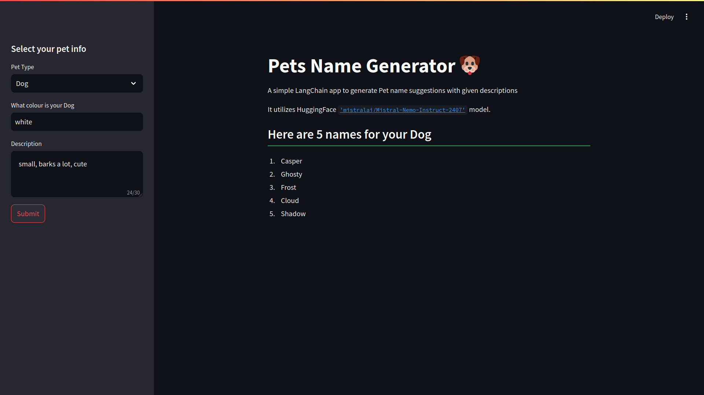

# LangChain Project

I'm just starting to learn LangChain from tutorials, this is the first & very simple project about it!

## Pet's name generator!


### **Generate few cool names for your pets!**



## How to run
* ### Setup Environment variables!

   Create `.env` environment variable file like [Example .env](./example.env)

* ### Installation & Running

1. Clone this [repository.]()
2. Install the requirements in a separate `python env`.    

    You can skip `pytorch` installation!
   ```python
    pip install -r requirements.txt
   ```
3. Run **streamlit** file `main.py` with this command
   
   ```bash
   streamlit run main.py
   ```
4. open `localhost` url as suggested.